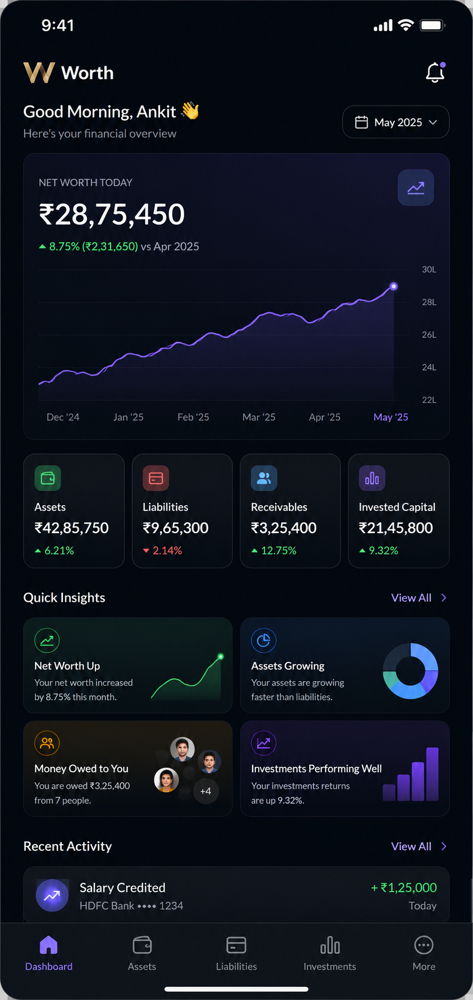

# 💎 Worth — Premium Wealth Intelligence Center & Personal Wealth OS

[](https://flutter.dev)
[](https://dart.dev)
[](https://opensource.org/licenses/MIT)
[](https://github.com/alokkumar2510/Worth)
[](https://github.com/alokkumar2510/Worth)

**Worth** is a privacy-first, premium personal wealth operating system and dashboard. Inspired by the designs of *Wealthfront*, *Copilot Money*, *Arc Browser*, and *Linear*, it completely moves away from generic finance templates and offers a state-of-the-art **Wealth Intelligence Center**. Track your net worth, manage assets, liabilities, receivables, investments, and expected income, and unlock beautifully animated custom-painted milestones.

---

## 🎨 Visual Showcase & Interactive UIs

Here is a preview of the luxury, glassmorphic dark-theme interfaces implemented in Worth:

### 1. Dashboard & Core Portfolio Overview
The dashboard features an interactive summary of your financial health, next milestones, and recent activity feed.
<p align="center">
  
</p>

### 2. Wealth Intelligence Center (Reports)
A clean, net-worth-focused reports screen showing your historical growth curve, allocation charts (Assets vs Liabilities vs Investments), and biggest monthly shifts.
<p align="center">
  
  
</p>

### 3. Portfolio Audits & Balance Adjustments
Users can manually adjust financial amounts with reason codes (Correction, Reconciliations, etc.) to capture downstream net-worth effects and maintain full audit logs.
<p align="center">
  
  
</p>
<p align="center">
  
  
</p>

### 4. Smart Transactions Timeline
Timeline grouping, collapsible advanced filter trays, and multi-category chips powered by seamless transitions.
<p align="center">
  
</p>

---

## ✨ Key Features

- **📊 Wealth Intelligence Reports**: Custom multi-trend charts, allocation summaries (assets/liabilities/investments), and automatic textual financial insights.
- **💎 Custom-Painted Milestones & Achievements**: Net worth milestones (from ₹1K to ₹10M+) and 23 custom achievements. Uses custom-painted mathematical crystal structures with animated glowing sweep-gradients.
- **🛡️ Flawless Biometric App Lock**: Secure local verification using `local_auth` integrated with GoRouter routing guards to prevent infinite authentication loops.
- **🔄 Firestore Multi-Database Sync**: Off-line first local database caching using Drift (SQLite) with background synchronization capabilities.
- **⚡ Advanced Transactions Activity**: Collapsible app bars, dynamic filtering, swipe gestures, and timeline groupings.

---

## 🛠️ Architecture & Tech Stack

Worth is structured following clean coding patterns and responsive architectures:

- **Frontend Core**: [Flutter](https://flutter.dev) (Dart)
- **State Management**: [Riverpod](https://riverpod.dev) (Notifiers, StateNotifier, and Provider Streams)
- **Database (Local)**: [Drift](https://drift.simonbinder.eu/) (High-performance reactive SQLite wrapper)
- **Database (Cloud Sync)**: [Firebase Firestore](https://firebase.google.com/docs/firestore)
- **Security & Route Guards**: [GoRouter](https://pub.dev/packages/go_router) & [local_auth](https://pub.dev/packages/local_auth)
- **Typography & Aesthetics**: Google Fonts (Inter, JetBrains Mono) & HSL-curated premium colors.

---

## 🚀 Getting Started

### Prerequisites
- Flutter SDK `3.44.2` or higher.
- Dart SDK `3.12.2` or higher.
- Android Studio / VS Code with Flutter extensions.

### Installation
1. Clone the repository:
   ```bash
   git clone https://github.com/alokkumar2510/Worth.git
   cd Worth
   ```
2. Install dependencies:
   ```bash
   puro flutter pub get
   ```
3. Run `build_runner` to compile Drift SQLite schemas and queries:
   ```bash
   puro flutter pub run build_runner build --delete-conflicting-outputs
   ```
4. Run the app:
   ```bash
   puro flutter run
   ```

---

## 📦 Releases

Download the latest production-ready APK directly from our releases:
* **[Download Worth v1.0.0 APK](https://github.com/alokkumar2510/Worth/releases/download/v1.0.0/app-release.apk)**

---

## 📜 License

Distributed under the MIT License. See `LICENSE` for more information.
