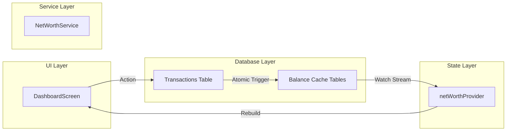
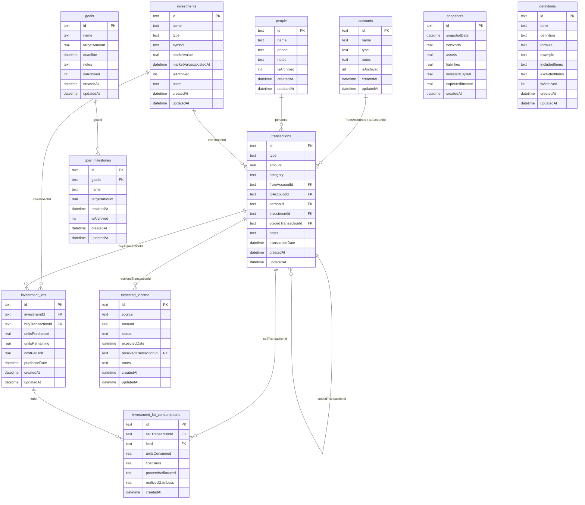

# Worth - Backend Architecture Document

This document outlines the backend architecture, local data storage strategy, and data flow patterns for **Worth**, a premium offline-first wealth management operating system.

---

## 1. Folder Structure

Worth follows a **feature-first** organization layered with Clean Architecture concepts. All business rules and data models live in the core/database layer, while feature folders encapsulate UI-specific presentation logic.

```text
lib/
├── core/
│   ├── constants/             # Global colors, size constants, asset paths
│   ├── theme/                 # Light/Dark theme styles and token bindings
│   ├── utils/                 # Extension helpers, formatters, validation utilities
│   ├── calculation/           # Cross-cutting business calculators (No feature imports)
│   │   ├── net_worth_service.dart      # Materializes aggregate positions
│   │   ├── balance_cache_service.dart  # Updates inline caches incrementally
│   │   └── fifo_lot_service.dart       # FIFO lot purchase matching & sales logic
│   └── services/              # Cross-cutting systems services
│       ├── backup_service.dart         # Encrypted JSON import/export
│       ├── encryption_service.dart     # AES-GCM data encryption
│       ├── search_index_service.dart   # FTS5 virtual table trigger management
│       └── snapshot_service.dart       # Lazy monthly snapshots backfill loader
│
├── database/                  # Drift Schema & Repository implementations
│   ├── tables/                # SQLite table declarations
│   │   ├── accounts.dart
│   │   ├── audit_logs.dart
│   │   ├── balance_caches.dart
│   │   ├── expected_income.dart
│   │   ├── goals.dart
│   │   ├── goal_milestones.dart
│   │   ├── investment_lots.dart
│   │   ├── investment_lot_consumptions.dart
│   │   ├── investments.dart
│   │   ├── people.dart
│   │   ├── settings.dart
│   │   ├── snapshots.dart
│   │   ├── definitions.dart
│   │   └── transactions.dart
│   ├── repositories/          # SQLite query abstractions (DAOs)
│   │   ├── account_repository.dart
│   │   ├── transaction_repository.dart
│   │   ├── person_repository.dart
│   │   ├── investment_repository.dart
│   │   └── ...
│   └── database.dart          # AppDatabase executor (SQLCipher configuration)
│
├── features/                  # UI features, controllers, view models
│   ├── dashboard/
│   │   ├── presentation/      # Screens, widgets
│   │   └── models/            # Feature-specific display states
│   ├── portfolio/
│   ├── transactions/
│   ├── reports/
│   ├── search/
│   ├── definitions/
│   ├── settings/
│   ├── onboarding/
│   └── auth/
│
└── main.dart                  # App entry point
```

---

## 2. Clean Architecture

Worth separates database dependencies, query operations, business computations, and UI state:

1.  **Drift Schema (Data Drivers)**: Native tables, FTS5 indexes, and raw SQL views.
2.  **Repository Layer (Gateways)**: Implements database operations (inserts, updates, stream watching, paginated keyset lists) with zero knowledge of wealth calculations or FIFO Lot consumption.
3.  **Service Layer (Use Cases)**: Coordinates multiple repositories to enforce financial business rules. **All calculations belong here.**
4.  **Riverpod Controller (Interface Adapters)**: Exposes reactive watch states, debounces user search queries, and manages screen-specific navigation flows.
5.  **Flutter Views (UI Framework)**: Listens to providers and renders components at 120fps.

---

## 3. Riverpod Architecture

Riverpod acts as the reactive data glue. Rather than manually invalidating providers on update, Worth leverages **Drift's reactive streams**.



> [!IMPORTANT]
> **Stream-Driven Updates**: Whenever a transaction is saved, Drift automatically alerts any active `StreamProvider` watching related cache tables. The UI updates instantly without manual invalidation hooks.

---

## 4. Repository Pattern

Repositories encapsulate database operations. All operations are strongly typed and return either Drift models or specialized aggregate rows.

### Repository Interface Example

```dart
abstract class IAccountRepository {
  Stream<List<Account>> watchActiveAccounts();
  Future<List<Account>> getActiveAccounts();
  Future<Account?> getAccountById(String id);
  Future<void> insertAccount(AccountsCompanion companion);
  Future<void> updateAccount(Account account);
}
```

By enforcing the Repository Pattern, the UI and Services are decoupled from Drift. If SQLite is swapped for a different local driver (e.g. Hive or ISar) in the future, only the Repository implementations change.

---

## 5. Service Layer

The Service layer coordinates multiple queries into atomic actions.

### Main Services:
*   `TransactionService`: Validates field presence matrixes before insertion. Writes the `Transaction` and recalculates/materializes the delta balance caches inside a single SQL transaction.
*   `FifoLotService`: Processes investment purchases (creating new lots) and investment sales (querying active lots sorted by purchase date, consuming them oldest-first, and creating log consumptions).
*   `NetWorthService`: Reads from account, person, and investment balance caches to calculate the net worth position instantly in `<50ms`.

---

## 6. Local Database Strategy

Worth is offline-first. To protect sensitive financial positions, the SQLite database is encrypted at rest using **SQLCipher**.

### Key Pillars:
1.  **SQLCipher Encryption**: Configured via the `NativeDatabase` setup hook by executing `PRAGMA key = '<passphrase>';` immediately upon opening the connection.
2.  **Balance Cache (Materialized Cache)**: Materializes balances for accounts, people, and investments. Read-heavy screens query only the cache tables.
3.  **FTS5 Search Index**: SQLite virtual table populated via database write triggers to support instant, prefix-based searches.
4.  **Replay Equivalence**: Safe recovery mechanism where the `BalanceRecalculationService` clears all cache rows and replays the immutable transaction log chronologically.

---

## 7. Data Flow Diagram

```mermaid
sequenceDiagram
    autofolder UI
    autofolder Service
    autofolder Repository
    autofolder SQLite

    UI->>Service: addTransaction(type: expense, amount: 4500)
    Service->>Service: Validate fields (e.g. fromAccountId presence)
    Service->>SQLite: transaction() block
    SQLite->>Repository: insertTransaction()
    Repository->>SQLite: INSERT INTO transactions
    SQLite->>Repository: updateAccountBalanceCache(accountId, -4500)
    Repository->>SQLite: UPDATE account_balance_cache
    SQLite->>Service: Commit
    SQLite-->>UI: Stream (account_balance_cache updated)
    UI-->>UI: Animate layout & update Net Worth values
```

---

## 8. Entity Relationships



---

## 9. State Management Plan

1.  **Reads**:
    *   Expose all entities via `StreamProvider`. For example, `activeAccountsProvider` maps `watchActiveAccounts()` query results directly to a stream.
    *   `netWorthProvider` combines the streams of account, person, and investment balance caches, calculating the total position dynamically.
2.  **Writes**:
    *   Expose write operations via `AsyncNotifierProvider`. The notifier manages states (idle, loading, error, success) for UI form fields.
    *   UI forms watch these notifiers to show loading indicators during saves and block double-submits.

---

## 10. Error Handling Strategy

1.  **Validation Boundaries**:
    *   Data format validations (e.g. verifying input amount > 0, ensuring account name is not blank) occur at the UI Layer.
    *   Financial rule validations (e.g. checking that a transfer has both source and target accounts, or that a sale does not exceed units held) occur at the Service Layer. Invalid calls throw a custom `FinancialValidationException`.
2.  **Database Failures**:
    *   SQLite lock issues or disk failures throw standard Drift exceptions.
    *   These are caught at the Repository layer and mapped to typed domain exceptions (e.g. `DatabaseWriteException`) to prevent raw database stack traces from reaching the UI.
3.  **UI Representation**:
    *   Views handle async errors using Riverpod's `AsyncValue.when(error: ...)` method, displaying clean error cards and retry prompts instead of crashing.
